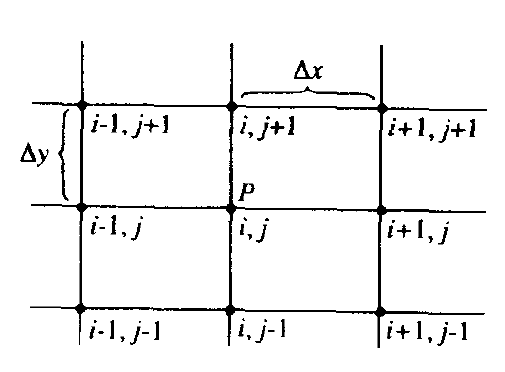

# Basic Aspects of Discretization

> In essence, discretization is the process by which a closed-form mathematical expression, such as a function or a differential or integral equation involving functions.

## Introduction to finite defferences

Solving Taylor series in $u _{i+1,j}$ about $u _{i,j}$ for $\left( \frac{\partial u}{\partial x}\right) _{i,j}$ we can get:

$$
\left( \frac{\partial u}{\partial x} \right) _{i,j} = \frac{u _{i + 1, j} - u _{i, j}}{\Delta x} - \left( \frac{\partial^2 u}{\partial x^2} \right) _{i,j} \frac{\Delta x}{2} - \left( \frac{\partial^3 u}{\partial x^3}\right) _{i,j} \frac{(\Delta x)^2}{6} + \dots
$$

$$\left(\frac{\partial u}{\partial x}\right) _{i,j}=\frac{u _{i+1,j}-u _{i,j}}{\Delta x}+O(\Delta x)
$$

which is called *first-order-accuracy.*

To construct a finite-difference quotient of *second-order-accuracy*, substract $u _{i-1,j}$ from $u _{i+1,j}$ in terms of Taylor series:

$$
u _{i+1,j} - u _{i-1,j} = 2\left(\frac{\partial u}{\partial x}\right) _{i,j} \Delta x + 2\left(\frac{\partial^3 u}{\partial x^3}\right) _{i,j} \frac{(\Delta x)^3}{6} + \dots
$$

$$
\left( \frac{\partial u}{\partial x} \right) _{i,j}=\frac{u _{i+1,j}-u _{i-1,j}}{2\Delta x}+O(\Delta x)^2
$$
